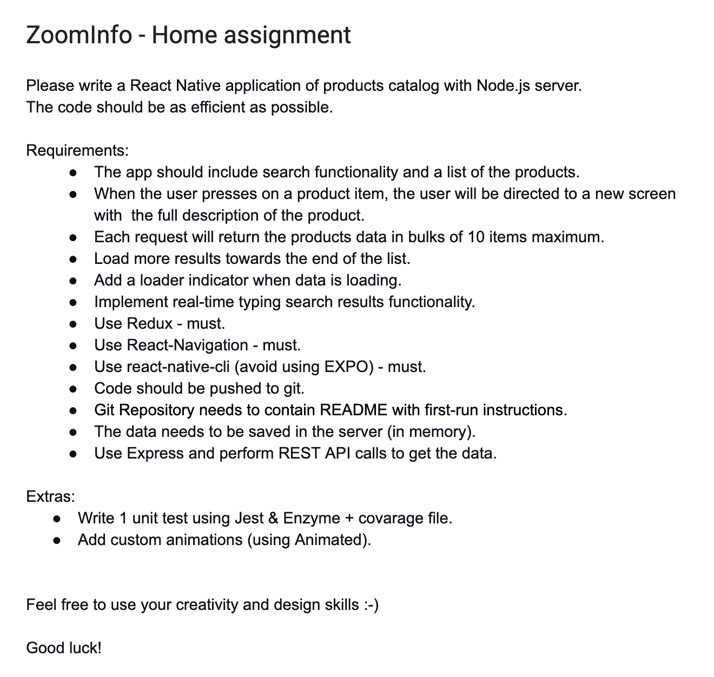
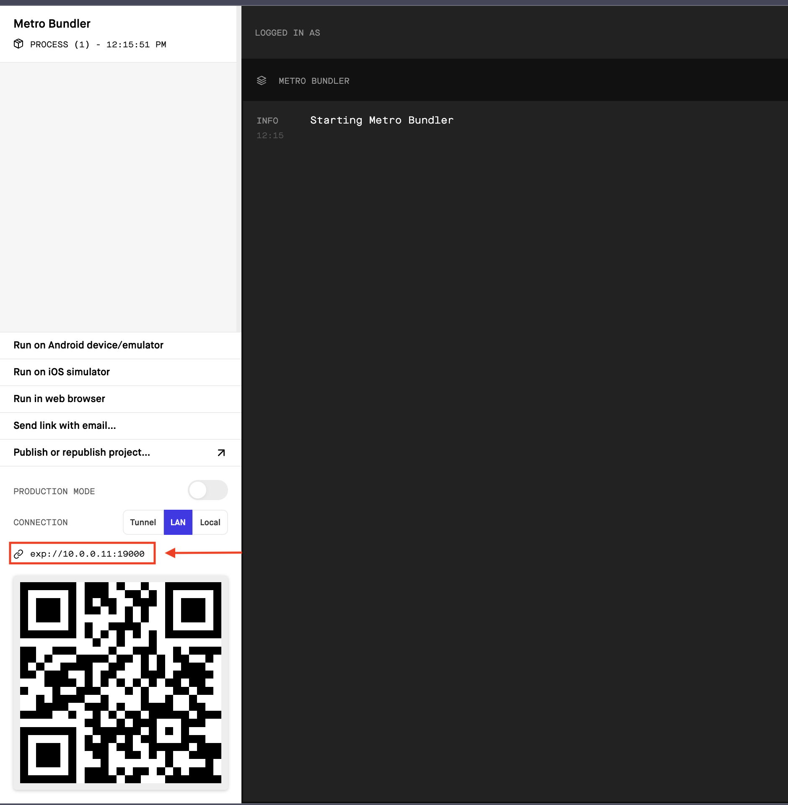

# ZoomInfo home assignment
<br>



----
<br>

## Tools

<br>

### Node

<br>

Make sure you have [Node](https://nodejs.org/en/) installed. Latests Version tested **16.13.0**

<br>

### Expo

<br>

Make sure you have [Expo](https://docs.expo.dev/get-started/installation/) installed. Latests Version tested **5.0.3**

<br>


### CocoaPods

<br>

Make sure you have [CocoaPods](https://cocoapods.org/) installed. Latests Version tested **1.11.2**

<br>

### Xcode

<br>

Make sure you have the latest XCode installed with command line tools. Latests Version tested **13.2.1**.

<br>

### Android Studio

<br>

Make sure you have the latest Android Studio ArticleFox and configured as well as the Java SDK. Latests Version tested **Android Studio Arctic Fox | 2020.3.1 Patch 4**.

<br>

----
<br>

## Setup
<br>

You need to setup the app and server by running the following command:

```bash
npm run setup
```

<br>

### Mobile 
<br>

#### Running on a device
<br>


You need to forward the local port of the server to the mobile device  by configuring baseURL as your computer `IP` with the port `3333` at the file `mobile/app.json`.




```json
//mobile/app.json

{
 ...
 "extra":{
      "baseURL": "http://10.0.0.11:3333" // At this case
  }
  ...
}
```


---
<br>

## Run 

<br>

You need to start the app and server by running the following command:

```bash
npm start
```

